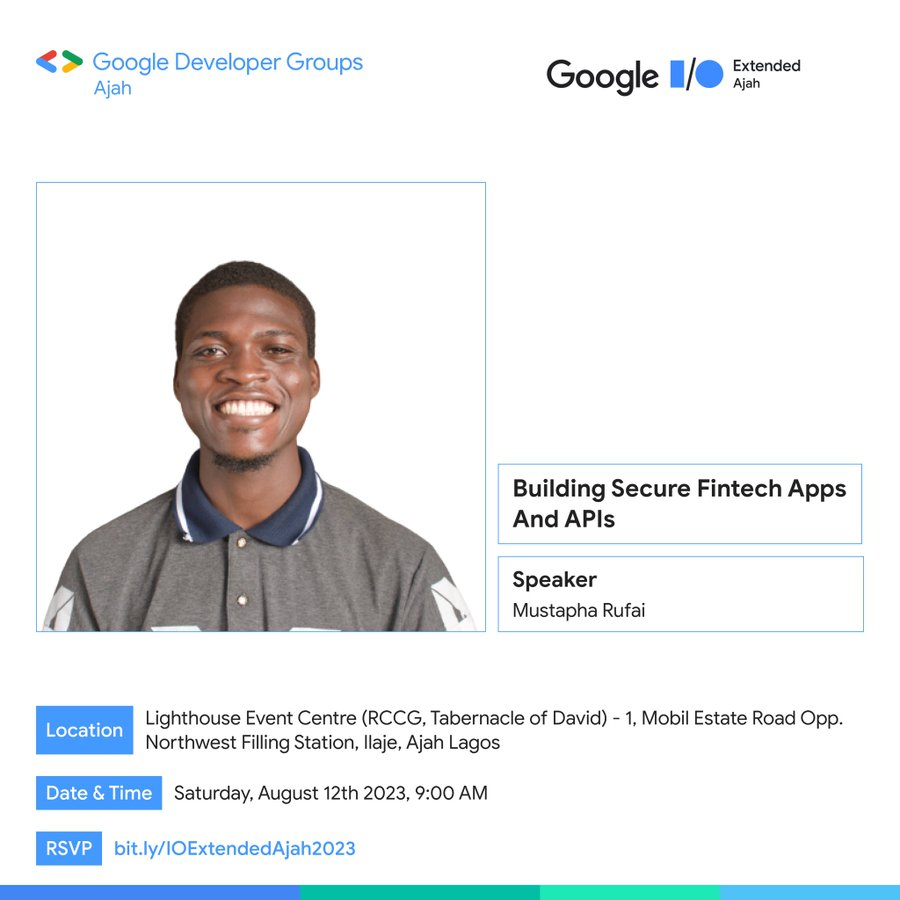

# How To Secure Your Web Application

Securing a web application is critical to protect user data, maintain trust, and comply with security standards. Here's a concise guide to best practices:

## 1. **Use HTTPS Everywhere**
- Secure all traffic with SSL/TLS.
- Obtain certificates from trusted authorities (e.g., Let's Encrypt).

## 2. **Implement Strong Authentication**
- Use secure password policies and hashing (e.g., bcrypt).
- Enable multi-factor authentication (MFA).
- Prevent brute-force attacks with rate limiting and CAPTCHA.

## 3. **Protect Against Common Vulnerabilities**
- Follow OWASP Top 10 recommendations:
  - **SQL Injection**: Use parameterized queries.
  - **XSS**: Sanitize and encode user input.
  - **CSRF**: Use CSRF tokens in forms.
  - **Insecure Deserialization**: Avoid trusting client input.
  - **Broken Access Control**: Enforce server-side permission checks.

## 4. **Secure User Input**
- Validate and sanitize input on both client and server.
- Avoid dynamic code execution from input.

## 5. **Manage Sessions Securely**
- Use secure, HTTP-only, and SameSite cookies.
- Regenerate session IDs after login.
- Implement automatic session timeouts.

## 6. **Use Secure Headers**
- Set headers like:
  - `Content-Security-Policy`
  - `X-Frame-Options`
  - `X-Content-Type-Options`
  - `Strict-Transport-Security`

## 7. **Secure Dependencies**
- Keep third-party libraries and frameworks up to date.
- Use tools like `npm audit`, `yarn audit`, or `OWASP Dependency-Check`.

## 8. **Monitor and Log Activity**
- Log security-related events (login attempts, errors).
- Use centralized log management and alerting.

## 9. **Implement Role-Based Access Control (RBAC)**
- Define roles and permissions clearly.
- Avoid hardcoding roles in logic.

## 10. **Regular Security Testing**
- Conduct code reviews, static/dynamic analysis.
- Perform regular penetration tests.
- Use automated vulnerability scanners.

## Bonus: Secure Deployment Practices
- Disable directory listing and debug modes.
- Restrict admin panels to trusted IPs.
- Use Web Application Firewalls (WAFs).

## Final Advice
- Follow secure development lifecycle (SDLC).
- Educate your development team regularly.
- Always assume your app **can be attacked**, and prepare accordingly.
