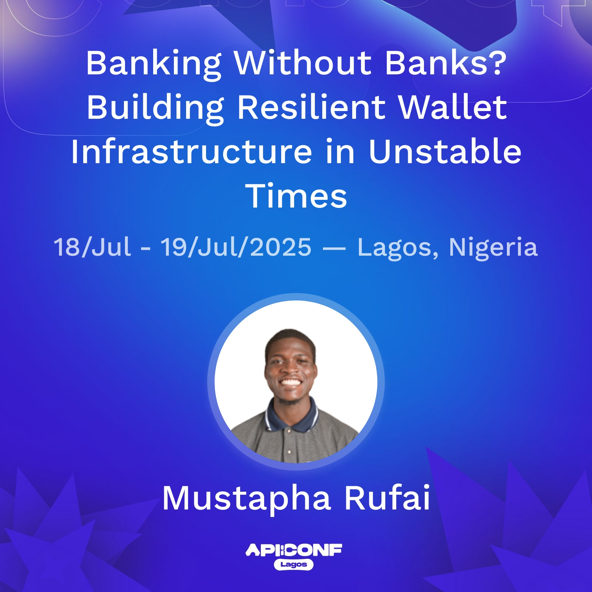

[More information here](https://sessionize.com/s/mustapha-rufai/banking-without-banks-building-resilient-wallet-in/140912)

In **January 2021**, Providus Bank announced they were shutting down their **virtual account service**. This sent many fintechs — including **PiggyVest**, **RiseVest**, and others — into a frenzy.

Engineering and business teams suddenly had to:
- Find new virtual account providers
- Build new integration rails
- Connect those rails to their systems
- Test the entire payment flow
- Make everything production-ready in record time

## How Were They Able to Do It?

In this talk, I will walk through how it’s possible using a **dummy fintech app** called **Akeke**.

I will explain the **best-practice microservice architecture** that makes it easy to:
- Turn off any external API
- Plug in a new one
- Go live in hours, not weeks

## Key Takeaways

This talk breaks down how the right architecture decisions empowered fintechs to pivot under pressure:
- ✅ **Microservices** for isolated, independently deployable services  
- ✅ **Abstraction layers** to decouple internal logic from external APIs  
- ✅ **Event queues** to handle asynchronous flows and retries  
- ✅ **Modular APIs** for plug-and-play integration

> The right architecture doesn't just scale — it saves you when everything breaks.
